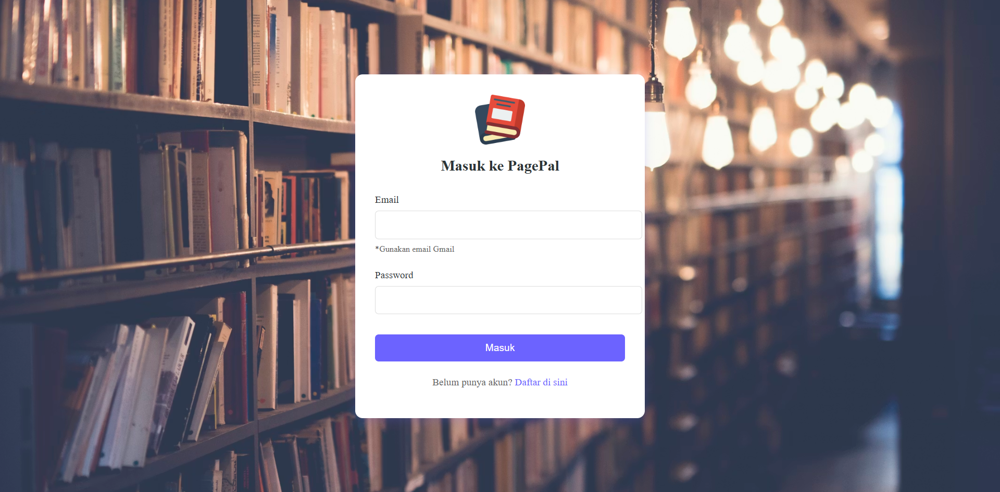
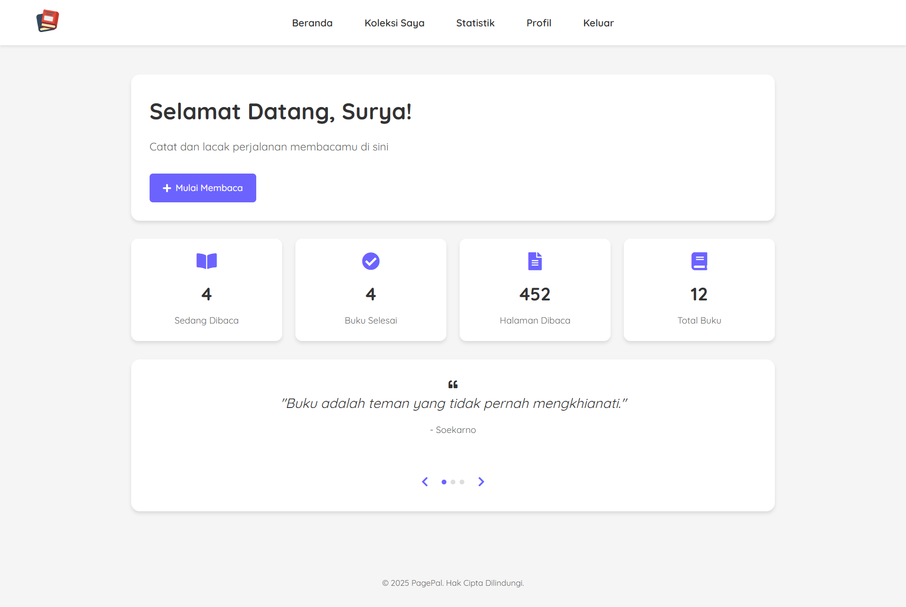

# 📖 Dokumentasi Lengkap PagePal

## Daftar Isi
- [Halaman Landing](#halaman-landing)
- [Autentikasi](#autentikasi)
- [Dashboard](#dashboard)
- [Koleksi Buku](#koleksi-buku)
- [Tambah Buku](#tambah-buku)
- [Detail Buku](#detail-buku)
- [Update Progress](#update-progress)
- [Profil](#profil)
- [Statistik](#statistik)

---

## Halaman Landing

Halaman utama yang menyambut pengunjung dengan informasi tentang PagePal.

**Fitur:**
- Penjelasan singkat tentang aplikasi
- Tombol "Mulai Sekarang" untuk mendaftar
- Tombol "Sudah Punya Akun?" untuk login

---

## Autentikasi

### Login

**Fitur:**
- Login dengan email dan password
- Link ke halaman registrasi

### Registrasi

**Fitur:**
- Daftar dengan nama, email, dan password
- Validasi input
- Link ke halaman login

---

## Dashboard

**Fitur:**
- Ringkasan statistik membaca
- Quote motivasi harian
- Akses cepat ke fitur utama

---

## Koleksi Buku

**Fitur:**
- Daftar semua buku dalam koleksi
- Filter berdasarkan status (Belum Mulai, Sedang Dibaca, Selesai)
- Pencarian buku
- Klik buku untuk melihat detail

---

## Tambah Buku

**Fitur:**
- Input judul, penulis, jumlah halaman
- Pilih cover default (6 pilihan)
- Upload cover custom (max 5MB)
- Validasi input

---

## Detail Buku

**Fitur:**
- Informasi lengkap buku
- Progress membaca dengan progress bar
- Ganti cover (default atau upload)
- Tambah catatan (max 3 per buku)
- Rating buku (untuk buku yang sudah selesai)
- Hapus buku

---

## Update Progress

**Fitur:**
- Update halaman yang sedang dibaca
- Otomatis update status:
  - Belum Mulai → Sedang Dibaca (saat mulai baca)
  - Sedang Dibaca → Selesai (saat sampai halaman terakhir)

---

## Profil

**Fitur:**
- Update foto profil (max 5MB, JPG/PNG)
- Update nama dan email
- Ganti password
- Statistik membaca ringkas

---

## Statistik

**Fitur:**
- Total buku dalam koleksi
- Buku yang sedang dibaca
- Buku yang sudah selesai
- Total halaman yang sudah dibaca
- Progress keseluruhan

---

## Teknologi yang Digunakan

| Teknologi | Kegunaan |
|-----------|----------|
| PHP 8.2 | Backend server |
| MongoDB Atlas | Database cloud |
| Cloudinary | Penyimpanan gambar cloud |
| Render | Hosting aplikasi |
| HTML/CSS/JS | Frontend |
| Font Awesome | Icons |

---

## Deployment

Aplikasi ini di-deploy menggunakan:
- **Render** - Web service dengan Docker
- **MongoDB Atlas** - Database cluster M0 (free tier)
- **Cloudinary** - Image storage (free tier)

Live URL: [https://pagepal-rrua.onrender.com](https://pagepal-rrua.onrender.com)
